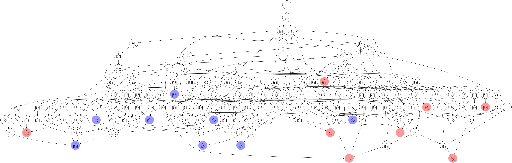
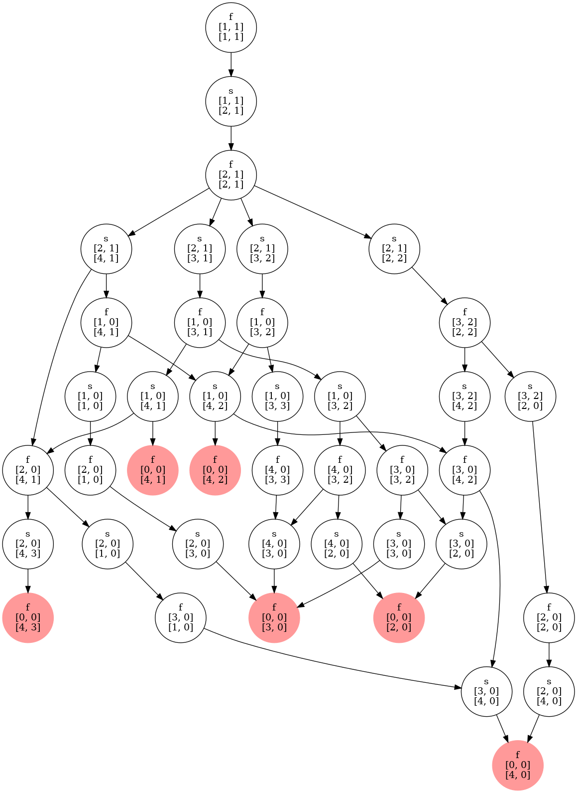

# Visualizing Waribashi Game

[](LICENSE)

## Summary

Visualize the state transition diagram of "Waribashi", which is some game played in Japanese.

## Usage

```sh
python waribashi.py
```

## Resuts




